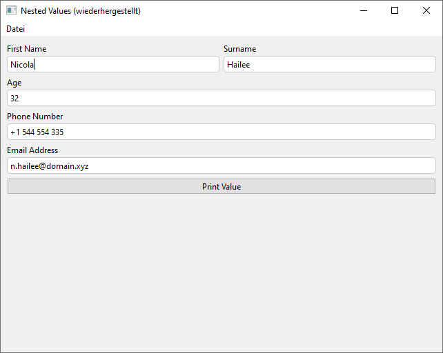
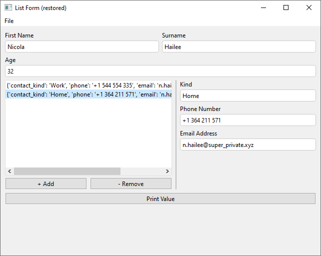
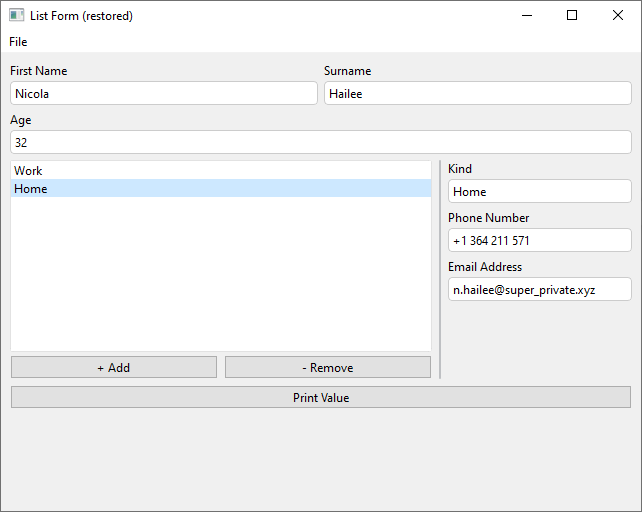

A key design decision when creating formify was the mixing of the UI with the data model. 
This allows for advanced functionality like autosave/autoload out of the box. 
However, it comes at the cost of flexibility. 
This section covers how data can be modeled using formify.

## Nested Values

This example shows a nested `Form` containing basic `contact_info`. 
The nested form can be placed inside a parent form and its data is placed into a sub-dict with the variable name given to the child form.

If you were to remove the `variable_name` of the `contact_info` Form, no sub-dict would be created. 


=== "Code"
    ```python
    import json
    from formify import *
    
    contact_info = Form(Col(
        ControlText("Phone Number", variable_name="phone"),
        ControlText("Email Address", variable_name="email"),
    ), variable_name="contact_info")
    
    
    main_from = Form(Col(
        Row(
            ControlText("First Name", variable_name="first_name"),
            ControlText("Surname", variable_name="surname"),
        ),
        ControlInt("Age", variable_name="age"),
        contact_info,
        ControlButton(
            "Print Value", 
            on_click=lambda: print(json.dumps(main_from.value, indent=2))
        ),
    ))
    
    MainWindow(main_from, margin=9, title="Nested Values")
    ```


=== "Data"
    `main_form.value` gives:
    ```json
    {
      "first_name": "Nicola",
      "surname": "Hailee",
      "age": 32,
      "contact_info": {
        "phone": "+1 544 554 335",
        "email": "n.hailee@domain.xyz"
      }
    }
    ```

=== "Screenshot"
    


#### Flatten Nested Values

`__flatten__` is a special variable name, that includes the fields in a form into the parent form. If we were to replace the `variable_name` in the contact form.... 

```python
contact_info = Form(Col(
    ControlText("Phone Number", variable_name="phone"),
    ControlText("Email Address", variable_name="email"),
), variable_name="__flatten__")
```

... the resulting data model would look like this:
    ```json
    {
      "first_name": "Nicola",
      "surname": "Hailee",
      "age": 32,
      "phone": "+1 544 554 335",
      "email": "n.hailee@domain.xyz"
    }
    ```


## Lists 

A `ListForm` can be used to model fields that can have multiple entries. 
Building from the example above, we can add an arbitrary number of contact information sets.

=== "Code"
    ```python
    import json
    from formify import *
    
    contact_info = Form(Col(
        ControlText("Kind", variable_name="contact_kind"),
        ControlText("Phone Number", variable_name="phone"),
        ControlText("Email Address", variable_name="email"),
    ))
    
    contact_info_list = ListForm(
        model_form=contact_info,
        variable_name="contact_info",
    )
    
    main_from = Form(Col(
        Row(
            ControlText("First Name", variable_name="first_name"),
            ControlText("Surname", variable_name="surname"),
        ),
        ControlInt("Age", variable_name="age"),
        contact_info_list,
        ControlButton(
            "Print Value",
            on_click=lambda: print(json.dumps(main_from.value, indent=2))
        ),
    ))
    
    MainWindow(main_from, margin=9, title="Nested Values")
    ```


=== "Data"
    `main_form.value` gives:
    ```json
    {
      "first_name": "Nicola",
      "surname": "Hailee",
      "age": 32,
      "contact_info": [
        {
          "contact_kind": "Work",
          "phone": "+1 544 554 335",
          "email": "n.hailee@domain.xyz"
        },
        {
          "contact_kind": "Home",
          "phone": "+1 364 211 571",
          "email": "n.hailee@super_private.xyz"
        }
      ]
    }
    ```

=== "Screenshot"
    


#### Custom Display Name


Define a `display_name_callback` to provide a custom label for a list entry. 

```python
contact_info_list = ListForm(
	model_form=contact_info,
	variable_name="contact_info",
	display_name_callback=lambda x: x["contact_kind"],
)
```





## Conditional Data


