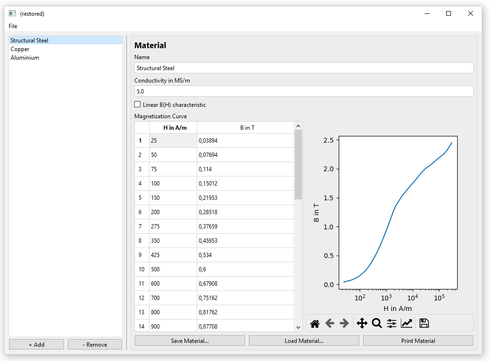

An editor GUI for the magnetic properties of materials. The `NonLinearUI` is implmented in an object-oriented way.


#### Screenshots

=== "Non-Linear Material"
    

=== "Linear Material"
    

#### Source

````python
from formify import *
import json
import numpy as np


def save_material():
	fn = tools.save_dialog("Save Material")
	if not fn:
		return
	with open(fn, "w+") as f:
		json.dump(material_form.value, f)


def load_current_material():
	fn = tools.open_dialog("Load Material")
	if not fn:
		return
	with open(fn) as f:
		material_form.value = json.loads(f.read())


def print_material():
	print(json.dumps(material_form.value, indent=2))


class NonLinearUI:
	def __init__(self):
		self.plot = ControlMatplotlib()
		self.table = ControlTable(
			label="Magnetization Curve",
			columns=["H in A/m", "B in T"],
			column_types=[float, float],
			variable_name="magnetization_curve",
		)

		self.ui = Row(
			self.table,
			self.plot,
		)

		self.draw = tools.BackgroundMethod(self._draw, lazy=True)
		self.table.change.subscribe(self.draw)

	def _draw(self):
		fig = self.plot.fig
		fig.clf()
		ax = fig.gca()

		B_H_data = np.array(self.table.value)
		ax.plot(B_H_data[:, 0], B_H_data[:, 1])

		ax.set_xlabel("H in A/m")
		ax.set_ylabel("B in T")
		ax.set_xscale("log")

		self.plot.draw()

checkbox_linear = ControlCheckbox("Linear B(H) characteristic", variable_name="is_linear")

# using ColSpaceBetween with a placeholder at the and makes sure the linear ui can expand just as the non-linear ui
ui_linear = ColSpaceBetween(
	ControlFloat("Relative permeability μr", value=1, variable_name="mur"),
	Placeholder(),
)

material_form = Form(Segment(
	h3("Material"),
	ControlText("Name", variable_name="name"),
	ControlFloatMega("Conductivity in MS/m", variable_name="conductivity"),
	ConditionalForm({
		True: ui_linear,
		False: NonLinearUI().ui,
	},
		condition_control=checkbox_linear,
		# "__flatten__" is a special variable name:
		# keys and values from are set in the parent level
		variable_name="__flatten__"
	),
	Row(
		ControlButton("Save Material...", save_material),
		ControlButton("Load Material...", load_current_material),
		ControlButton("Print Material", print_material),
	),
))

materials_form = ListForm(
	tools.maximize(material_form),
	variable_name="materials",
	display_name_callback=lambda material: material['name'],
)

MainWindow(materials_form, margin=8)
````