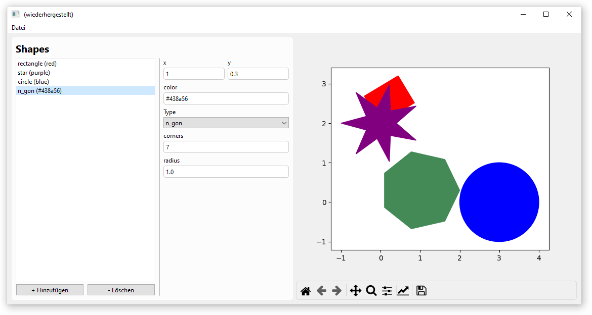

A [matplolib](https://matplotlib.org/) figure embedded in a formify GUI. The UI changes based on the selected shape. A Circle only shows an input for the radius, while the rectangle shows controls for width, height and angle. 

The list containing the shapes can be reordered using drag and drop. Drawing in matplotlib happens in a background thread (`tools.BackgroundMethod`) to keep the UI responsive.

#### Screenshot




#### Source

=== "shapes_gui.py"
    ````python
    from formify import *
    import copy
    # import shapes.py
    import shapes
    
    
    form = Form(
        Col(
            Row(
                ControlFloat(variable_name="x"),
                ControlFloat(variable_name="y"),
            ),
            ControlText(variable_name="color", value="red"),
            ConditionalForm({
                "rectangle": Col(
                    ControlFloat(variable_name="width"),
                    ControlFloat(variable_name="height"),
                    ControlFloat("Angle in °", variable_name="angle"),
                ),
                "circle": Col(
                    ControlFloat(variable_name="radius"),
                ),
                "n_gon": Col(
                    ControlInt(variable_name="corners"),
                    ControlFloat(variable_name="radius"),
                ),
                "star": Col(
                    ControlInt(variable_name="corners"),
                    ControlFloat(variable_name="inner_radius"),
                    ControlFloat(variable_name="outer_radius"),
                ),
            }, variable_name="__flatten__"),
        )
    )
    
    list_form = ListForm(
        form,
        display_name_callback=lambda x: f'{x["type"]} ({x["color"]})',
        variable_name="list_form"
    )
    
    plot = ControlMatplotlib()
    
    
    def _draw():
        # setup
        plot.fig.clear()
        ax = plot.fig.subplots()
        ax.set_aspect('equal')
    
        # plotting
        for data in copy.deepcopy(list_form.value):
            func = getattr(shapes, data.pop("type"))
            func(ax, **data)
    
        # show
        ax.plot()
        plot.draw()
    
    
    draw = tools.BackgroundMethod(_draw, lazy=True)
    list_form.change.subscribe(draw)
    tools.maximize(list_form)
    
    ui = Row(
        SegmentLight(
            h2("Shapes"),
            list_form,
        ),
        plot
    )
    
    MainWindow(ui, margin=8)
    ````

=== "shapes.py"
    ````python
    import matplotlib.pyplot as plt
    import numpy as np
    import cmath
    
    def rectangle(ax, x, y, width, height, angle, color):
        ax.add_patch(
            plt.Rectangle((x, y), width, height, angle=angle, color=color)
        )
    
    
    def circle(ax, x, y, radius, color):
        ax.add_patch(
            plt.Circle((x, y), radius, color=color)
        )
    
    
    def polygon(ax, xs, ys, closed, color):
        ax.add_patch(
            plt.Polygon(np.array([xs, ys]).T, closed=closed, color=color)
        )
    
    def star(ax, x, y, corners, inner_radius, outer_radius, color):
        if corners < 2:
            return
        angles_outer = np.linspace(0, 2*np.pi, corners, endpoint=False)
        angles_inner = angles_outer + 2 * np.pi / corners / 2
    
        center = x + 1.j * y
        ps = []
        for angle_inner, angle_outer in zip(angles_inner, angles_outer):
            ps.append(cmath.rect(outer_radius, angle_outer) + center)
            ps.append(cmath.rect(inner_radius, angle_inner) + center)
        ps = np.array(ps)
    
        polygon(ax, ps.real, ps.imag, closed=True, color=color)
    
    
    def n_gon(ax, x, y, corners, radius, color):
        if corners < 2:
            return
        angles = np.linspace(0, 2*np.pi, corners, endpoint=False)
        center = x + 1.j * y
        ps = [
            cmath.rect(radius, angle) + center for angle in angles
        ]
        ps = np.array(ps)
    
        polygon(ax, ps.real, ps.imag, closed=True, color=color)
    
    
    
    if __name__ == "__main__":
        # setup
        ax = plt.subplots()[1]
        ax.set_aspect('equal')
    
        # create patches
        rectangle(ax, 1, 1, 1, 2, 0, "b")
        circle(ax, 2, 3, 1, "r")
        star(ax, 2, 0, 12, 0.7, 2, "k")
        n_gon(ax, 0, 2, 5, 1, "yellow")
    
        # plotting
        ax.plot()
        plt.show()
    ````
