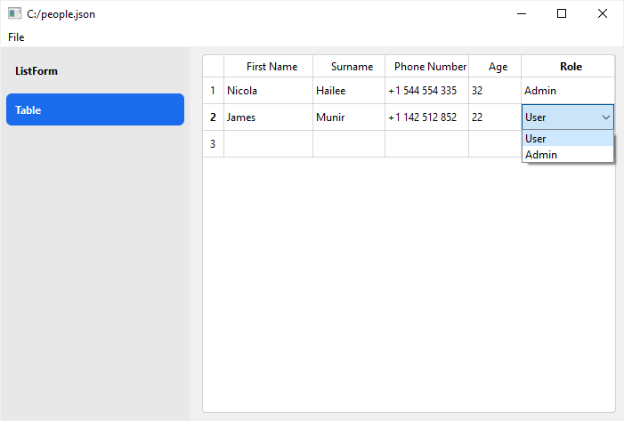

A basic editor for personal data.


#### Screenshots
=== "List Form"
    

=== "Table"
    

#### Data Model

The data model between the `ListForm` and `ControlTable` implementation is different. The `ListForm` workes with a list of dicts, whereas the `ControlTable` uses a 2D list.

=== "List Form"
    ```json
    {
      "people": [
        {
          "first_name": "Nicola ",
          "surname": "Hailee",
          "phone": "+1 544 554 335",
          "age": 32,
          "role": "Admin"
        },
        {
          "first_name": "James ",
          "surname": "Munir",
          "phone": "+1 142 512 852",
          "age": 22,
          "role": "User"
        }
      ]
    }
    ```

=== "Table"
    ````json
    {
      "people_table": [
        [
          "Nicola ",
          "Hailee",
          "+1 544 554 335",
          32,
          "Admin"
        ],
        [
          "James ",
          "Munir",
          "+1 142 512 852",
          22,
          "User"
        ]
      ]
    }
    ````

#### Source

````python
from formify import *

# Option 1: A list form with a person form
person_form = Form(Col(
	ControlText("First Name", variable_name="first_name"),
	ControlText("Surname", variable_name="surname"),
	ControlText("Phone Number", variable_name="phone"),
	ControlInt("Age", variable_name="age"),
	ControlSelect("Role", items=["User", "Admin"], variable_name="role", value="User")
))

ui_list = ListForm(
	person_form,
	variable_name="people",
	display_name_callback=lambda person: f"{person['first_name']} {person['surname']} - {person['role']}"
)

# Option 2: A table
ui_table = ControlTable(
	label="",
	columns=["First Name", "Surname", "Phone Number", "Age", "Role"],
	column_types=[str, str, str, int, ("User", "Admin")],
	variable_name="people_table"
)

ui = SidebarContentView({
	"ListForm": ui_list,
	"Table": ui_table,
})

MainWindow(ui)
````