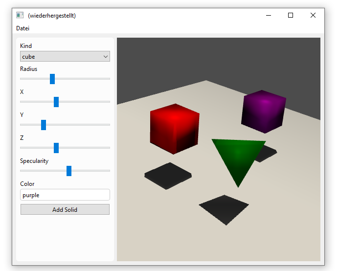

A [Pyvista](https://docs.pyvista.org/) plot embedded in a formify GUI. Shapes are added to the Pyvista scene using the UI.

#### Screenshot




#### Source


````python
from formify import *
import pyvista as pv

plot = ControlPyvista()

plot.plotter.view_vector((5.0, 2, 3))
plot.plotter.add_floor('-z', lighting=True, color='white', pad=10)
plot.plotter.enable_shadows()


def add_solid():
    data = form.value
    solid = pv.PlatonicSolid(
        data["kind"],
        radius=data["r"],
        center=(data["x"], data["y"], data["z"])
    )
    plot.plotter.add_mesh(
        solid, color=data["color"], smooth_shading=True, specular=data["specularity"], specular_power=10
    )


form = Form(Row(
    SegmentLight(
        ControlSelect("Kind", variable_name="kind", items=[
            'tetrahedron',
            'cube',
            'octahedron',
            'dodecahedron',
            'icosahedron',
        ]),
        ControlSlider("Radius", variable_name="r", value=0.4, minimum=0.1, maximum=4),
        ControlSlider("X", variable_name="x", value=0, minimum=-5, maximum=5),
        ControlSlider("Y", variable_name="y", value=0, minimum=-5, maximum=5),
        ControlSlider("Z", variable_name="z", value=0, minimum=0, maximum=5),
        ControlSlider("Specularity", variable_name="specularity", value=0, minimum=0, maximum=1),
        ControlText("Color", variable_name="color", value="silver"),
        ControlButton("Add Solid", add_solid),
        maximum_width=200,
    ),
    plot
))

MainWindow(form, margin=8)
````
