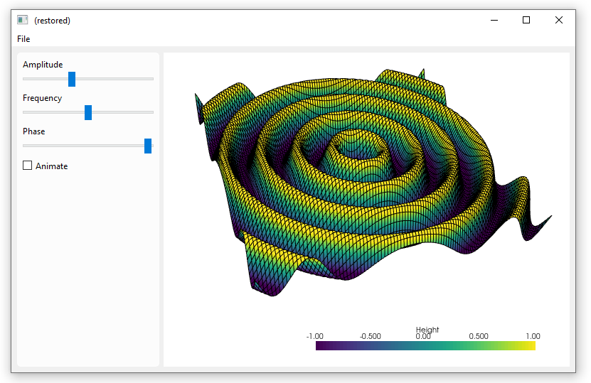

A [Pyvista](https://docs.pyvista.org/) plot embedded in a formify GUI. The plot can be manipulated and animated using the controls on the left.


=== "Screenshot"
    
=== "Video"
    

#### Source


To run this example you need to install pyvista first:
```bash
pip install pyvista && pip install pyvistaqt
```

````python
from formify import *
import pyvista as pv
import numpy as np
from time import sleep

plot = ControlPyvista()
plot.plotter.set_background("white")

x = np.arange(-10, 10, 0.2)
y = np.arange(-10, 10, 0.2)
x, y = np.meshgrid(x, y)
r = np.sqrt(x**2 + y**2)
z = np.sin(r)

# Create and structured surface
grid = pv.StructuredGrid(x, y, z)

# Create a plotter object and set the scalars to the Z height
mesh = plot.plotter.add_mesh(
	grid,
	scalars=z.ravel(),
	lighting=False,
	show_edges=True,
	scalar_bar_args={"title": "Height", "color": "black"},
	clim=[-1, 1],
)

pts = grid.points.copy()


def update_plot():
	data = form.value
	z = data["amplitude"] * np.sin(data["frequency"] * r + data["phase"])
	pts[:, -1] = z.ravel()
	plot.plotter.update_coordinates(pts, render=False)
	plot.plotter.update_scalars(z.ravel(), render=True)


check_animate = ControlCheckbox("Animate", variable_name="animate")
slider_phase = ControlSlider("Phase", variable_name="phase", value=0, minimum=0, maximum=2 * np.pi, ticks=10000)

form = Form(Row(
	SegmentLight(
		ControlSlider("Amplitude", variable_name="amplitude", value=1, minimum=-5, maximum=5, ticks=10000),
		ControlSlider("Frequency", variable_name="frequency", value=1, minimum=0, maximum=5, ticks=10000),
		slider_phase,
		check_animate,
		maximum_width=200,
	),
	plot
))
form.change.subscribe(update_plot)


@tools.BackgroundMethod
def start_animation():
	while True:
		if check_animate.value:
			slider_phase.value = (slider_phase.value + 0.1) % (2 * np.pi)
		sleep(1 / 60)


start_animation()

MainWindow(form, margin=8, width=800, height=550)
````
