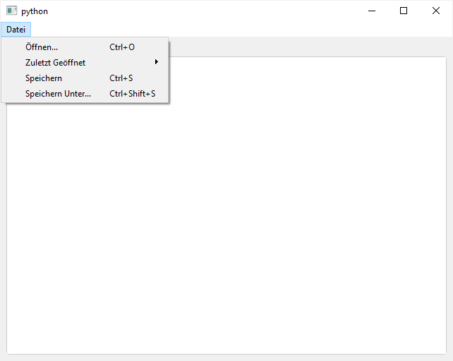
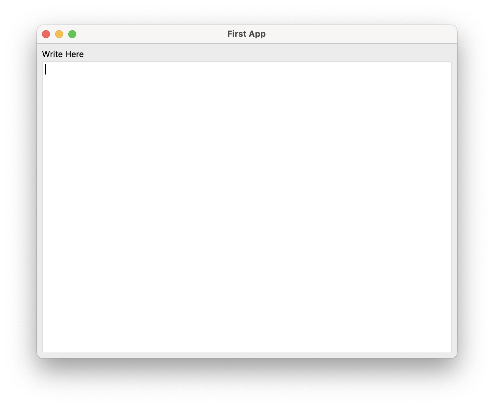

<figure markdown></figure>

An easy-to-use Python UI Framework on top of Qt (PySide6). Simple things are simple, hard things are not any harder than they are in Qt.

## Features

- Cross Platform: Tested on Windows and macOS
- Low Boilerplate: Save, load and autosave functionality out of the box
- A unified API to set and retrieve data in UI elements
- Layout using tabs, segments, a sidebar and a grid system `Row`, `Col` 
- Singe instance enforcement
- Installation UI based on PyInstaller (Windows only)


## Install

Install formify using PyPi:
```bash
pip install formify
```

## First App

Write your first App featuring a text area with save, load, and autosave functionality.
```python
from formify import *

ui = ControlTextarea("Write Here", variable_name="text")

MainWindow(ui, title="First App", margin=8)
```

=== "Windows"
    

=== "macOS"
    

## More Examples

Check out the [Gallery](gallery/people) for more examples.